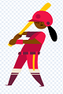
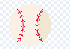

# Feladatok

## 1. Baseballgame

Javasolom, hogy ezt a feladatot egyes videók megnézése után, részletekben valósítsd meg. Minden feladatrészletnél jelzem, hogy melyik videó után érdemes megvalósítani!

A játékról:  
A feladatod egy olyan játék megvalósítása lesz, ahol egy baseball labdával kell, egyre gyorsabban felfelé szálló lufikat eltalálnod. A játék megoldását megtalálod itt: https://scratch.mit.edu/projects/642064569/   vagy a solutions könyvtárban. 

#### A játék előkészítése
A játkban 4 szereplőre lesz szükséged. A következőket megalálod a már elkészített szereplők között: `Batter`, `Ballon 1`, `Baseball`. A negyediket pedig neked kell megrajzolnod. Ez pedig legyen egy célkereszt.  
 Batter			|  Ballon 			| Baseball		| Saját
:-------------------------:|:-------------------------:|:-------------------------:|:-------------------------:
 |  |  |  
Méret: 50 % | Méret: 50 % | Méret: 30 % | Méret: kb mint a Basball
Pozíció: (0, -111) | később | később | később 

Állítsd be a játék hátterét a `Baseball 1` nevű háttérre. 

#### Mindig ciklus
A célkersztünk kódját már meg tudod írni. A cél, hogy zászlóra kattintás után mindig ugorjon az egérmutató helyére. Ha elindítod a játékot a célkeresztnek követnie kell az egérmutatót.  

A basball labdánál egyelőre állítsuk be, hogy szóköz lenyomásakor ugorjon valahova a játékos elé és nézzen az egérmutató felé, és jelenjen meg. A "szóköz gomb lenyomásakor" blokkot az események között találod. 

#### Egy logikai művelet bemutatása
Hozzd létre az "élet" változót (minden szereplő tudhat róla). A `Batter` szereplőnél oldjuk meg, hogy a játék indításakor az első jelmeze legyen aktív és az élet változó legyen 3. Ezután figyeljük, ha az élet változó 0 lesz, akkor állítsunk le mindent.  

A lufi mindig a játéktér aljáról indul véletlen helyről. Az y pozícióját egészen addig változtatjuk 2-vel, amíg el nem érte a játéktér szélét vagy nem érintette a labdát. Ha valamelyik bekövetkezik, tűnjön el a lufi, majd kezdődjön a felfelé mozgás előről. Ha a lufi érintette a játéktér szélét, akkor veszítsünk egy életet.  

A `Baseball` a szóköz lenyomásakor kezdi meg a mozgást. Hozzuk létre a "labdasebesség" változót, úgy hogy mindenki lássa. Amikor lenyomjuk a szóközt a labda tehát pozícióba kerül, az egérmutató felé néz, megjelenik és a kezdeti sebessége legyen 1. Ezután egészen addig amíg el nem éri a játéktér szélét, növeljük 1-el a labdasebességet, és mozgassuk a labdát "sebességnyit". Így elértük, hogy a szóköz lenyomásakor az egérmutató irányába gyorsulva megindul a labda a játéktér széléig és ha ütközik egy lufival a lufi eltűnik és egy új jelenik meg a játéktér alján. (A sebesség mértékét persze egyénileg nyugodtan módosíthatod.)

#### Listák
A baseballban gyakran mérik az egyes elütött labdák sebességét. Mivel a labdák különböző sebességekkel érik el a lufikat, ezért ezeket tároljuk el listában. Ehhez hozzuk létre a "Labdasebességek" listát, úgy hogy mindenki lássa.  

Amikor a zászlóra kattintunk a lufinál mindig töröljük a lista minden elemét.  

Miután egy lufi mozgásának végéhez értünk, nézzük meg, hogy éppen érinit-e a falat vagy nem, ha nem akkor a labdasebesség változó értékét mentsük el a listánkba és csak ez után tüntessük el a lufit. 

#### A blokkokról részletesen
Később szükségünk lesz rá, hogy számoljuk a lufikat ezért hozzuk létre a "lufidb" változót, melyről csak a lufi tudjon és a játék kezdetén állítsuk nullára.  

A lufi mozgását kiszervezzük egy külön blokkba. A blokk neve lehet "LufiMozgás" és a lufi teljes mozgását a megjelenéstől az eltűnésig ez a blokk csinálja. A blokk végén növeljük 1-el a lufik darabszámát. Oldjuk meg a lufi mozgásán belül, hogy közvetlen környezetünkben ne jelenhessen meg lufi. A közvetlen környeztünk jelentsen 75 távolságot mindkét irányba. 

Tipp: Valahányszor legenerálod a lufi helyét nézd meg, hogy megfelelő pozícióban van-e és ha nincs generáld újra.  

Animáljuk meg a `Batter` szereplő mozgását. Mint látható a szereplőnek négy különbőző jelmeze van, aminek egymásutáni megjelenítése egy labda elütését ábrázolja. Amikor lenyomjuk a szóközt, a szereplő 4 különböző lejmezét jelenítsük meg egymás után. Minden jelmez váltás között várjunk 0.1 másodpercet. Lehetőség szerint ezt ciklusban tegyük meg!

#### Parméterátadásról részletesen
Azt fogjuk megoldani, hogy minden 3. lufi után a lufi sebessége növekedjen, azaz egyre gyorsabban száljanak fel a lufik.  

Ehhez először vegyünk fel egy változót "lufisebesség" néven és a játék kezdetén állítsuk kettőre. 

Szerkeszzük a "LufiMozgás" blokkot úgy, hogy várjon egy szám paramétert aminek neve legyen sebsség. Módosítsuk a blokkot, hogy a lufi mindig a paraméternek megfelelően menjen felfelé. Amikor a blokkot használjuk az előbb létrehozott "lufisebesség" változót adjuk át neki.  

A fő blokkunkban minden "LufiMozgás" végrehajtás után vizsgáljuk meg, hogy hányadik lufinál tartunk és minden harmadik lufiután növeljük a sebességet 0.5-tel (vagy amennyivel gondolod). Az ellenőrzéshez használd a "lufidb" változót. 

#### Üzenet küldése
A játékot úgy módosítjuk, hogy ne a szóközzel, hanem egérkattintással lehessen elütni a baseball labdát.  

A `Batter` kódját módosítsuk úgy, hogy szóköz lenyomás helyett egér kattintáskor váltson jelmezt, és küldjön egy üzenetet, pl.:"Kilövés". A `Baseball` pedig ezen üzenet érkezésekor kezdjen el repülni. 

Szintén itt, amikor elfogyott minden életünk küldjünk üzenetet, hogy "Játék vége" és állítsuk le az eljárást. Ezen üzenet érkezéskor állítsuk le a lufik mozgását is.  

 
#### Megszámlálás

A `Baseball` szereplőnél, a Játék vége üzenet érkezésekor számoljuk meg a "Labdasebességek" listában, hogy hányszor volt nagyobb a labdák sebessége mint húsz és egy változóban jelenítsük meg a képernyőn.  

Bónusz: A legnagyobb sebességet is keressük meg és jelenítsük meg.  

 

## 2. Pong-Game
Ezt a feladatot a videók megnézése után önállóan oldd meg!

#### A játék rövid leírása
##### Alapjáték:
A játék egy klasszikus pong játék, ahol egy platformot kell mozgatni és megakadályozni, hogy a labda leessen. 
##### Haladó:
A játéktér tetején téglákat helyezünk el és a labdával ezeket kell széttörni. A játék addig megy, amíg mindet szét nem törtük. 

A játék megoldását eléred itt: vagy a solutions mappában. 

#### Megvalósítás
A platformot x tengely mentén lehessen mozgatni a nyilak segítségével. A labda össze-vissza kell hogy mozogjon a szélek között. Elindul egy irányba (nem gyorsul) és ha széléhez ér visszapattan. Ehhez használd a `ha szélen vagy pattanj vissza` utasítást. A platformról való visszapattanás megvalósításához célszerű a platform érintésekor a labda irányát megváltoztatni a megfelelő szöggel.

